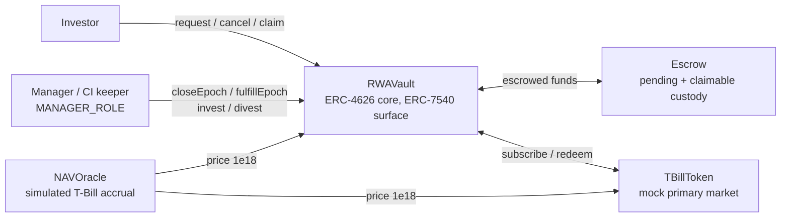

# Tokenized T-Bill Fund — ERC-4626 × ERC-7540 RWA vault

**Live demo (Sepolia): https://tokenized-tbill.onrender.com**

A working simulation of an institutional tokenized T-Bill fund: a single vault
that is [ERC-4626](https://eips.ethereum.org/EIPS/eip-4626) at its accounting
core and [ERC-7540](https://eips.ethereum.org/EIPS/eip-7540) at its interaction
surface. Deposits and redemptions are collected into epochs, become binding at
a cut-off, and settle at a NAV struck *after* the cut-off — forward pricing,
the way real funds price orders.

I built this to understand the RWA vault standards in depth: how ERC-7540
layers onto ERC-4626, why asynchronicity is the honest way to price a fund
of T-Bills, and what an institutional settlement pipeline (transfer agent,
fund accountant, escrowed subscriptions) looks like written in Solidity.

## Architecture



- **`RWAVault`** inherits OpenZeppelin `ERC4626` untouched (share accounting,
  conversion math, inflation-attack mitigation) and adds the full ERC-7540
  request/fulfill/claim machine on top. `totalAssets() = cash + T-Bills at
  the oracle price`. One `fulfillEpoch()` settles a whole epoch at one
  struck NAV — every request of an epoch gets the same price, by
  construction (invariant I1).
- **`Escrow`** holds everything that is *not yet or no longer* the fund's:
  pending deposits, pending redeem shares, unclaimed entitlements. The
  vault's NAV is physically unable to count pending money.
- **`NAVOracle`** simulates T-Bill accrual — configurable rate, a time-scale
  factor so yield is visible in a live demo, manual mark-to-market shocks.
- **`TBillToken` / `MockUSDC`** — the mock security with its primary market,
  and a faucet USDC so anyone can try the flow with just Sepolia gas.

## What this shows

- **Standards discipline** — ERC-4626 is inherited, never reimplemented; the
  7540 layer overrides entry points only where the spec mandates it
  (`preview*` revert, `deposit/mint/withdraw/redeem` become claim functions,
  `max*` report claimables). Full operator model, ERC-7575 `share()`,
  ERC-165 detection of the async flows.
- **Institutional realism** — two-phase epochs (cut-off then settlement),
  binding orders, subscription/redemption netting at one NAV, a manager who
  controls *when* but never *at what price*, cash-float portfolio policy.
- **Verification depth** — 77 Foundry tests: full lifecycle units, an
  access-control matrix, and a fuzzed invariant campaign (9 invariants,
  black-box ghost accounting, `fail-on-revert`) —
  [invariants-and-testing.md](docs/invariants-and-testing.md).
- **A real operational layer** — Etherscan-verified deployment, an unattended
  GitHub Actions keeper holding only `MANAGER_ROLE`, a static React frontend
  that rebuilds the NAV timeline by replaying chain events (no indexer, no
  backend) — [operations.md](docs/operations.md).

## Deployed contracts (Sepolia)

All Etherscan-verified. Full record and key policy in
[operations.md](docs/operations.md).

| Contract | Address |
|---|---|
| RWAVault (`fTBILL`) | [`0x925B7c0cbfd74E7CBAE348541C629EC1ff33aa9C`](https://sepolia.etherscan.io/address/0x925B7c0cbfd74E7CBAE348541C629EC1ff33aa9C) |
| Escrow | [`0x2d3efE14E06c82F4F470648eb71194870Bf9D8fb`](https://sepolia.etherscan.io/address/0x2d3efE14E06c82F4F470648eb71194870Bf9D8fb) |
| NAVOracle | [`0x200832A82DC75FdAe22191E1563d72667542Fbe3`](https://sepolia.etherscan.io/address/0x200832A82DC75FdAe22191E1563d72667542Fbe3) |
| TBillToken | [`0x38705BD52F94db088bF537c1A811EE4a03a0E70A`](https://sepolia.etherscan.io/address/0x38705BD52F94db088bF537c1A811EE4a03a0E70A) |
| MockUSDC | [`0x098837194e00Ce31B6fB3b8879af576FB50D9A5f`](https://sepolia.etherscan.io/address/0x098837194e00Ce31B6fB3b8879af576FB50D9A5f) |

## Repository layout

```
contracts/   Foundry project — sources, 77 tests, deploy script
frontend/    React + wagmi/viem — 3 views (Overview / Invest / Operate)
keeper/      Node + viem demo keeper, run by GitHub Actions cron
docs/        design & engineering documentation (see reading order below)
```

## Quick start

```bash
# unit tests + fuzzed invariant campaign (77 tests), from the repo root
cd contracts && forge test
```

That is the only thing worth running locally: the frontend is hosted and the
keeper runs on a GitHub Actions cron — [operations.md](docs/operations.md)
covers both, including how to run them yourself if you want to.

To try the live demo: get Sepolia ETH, open the
[site](https://tokenized-tbill.onrender.com) → **Invest** → faucet USDC →
request a deposit. The keeper settles pending epochs within ~30 minutes; then
claim your `fTBILL` shares and watch the NAV accrue on **Overview**.

## Documentation

Written to be read in this order:

| Doc | What it covers |
|---|---|
| [rwa-funds-and-standards.md](docs/rwa-funds-and-standards.md) | How institutional funds settle, why synchronous 4626 can't model it, what 7540/7575 fix, and how BUIDL / BENJI / OUSG / Centrifuge do it in production |
| [contracts-tour.md](docs/contracts-tour.md) | Guided tour of the five contracts: epoch machine, fulfillment order, lazy settlement, rounding policy, spec-compliance mapping |
| [design-decisions.md](docs/design-decisions.md) | The decision log (D1–D10): every structural choice, its alternatives, and why they were rejected |
| [invariants-and-testing.md](docs/invariants-and-testing.md) | The nine invariants and how the test suite actually proves them |
| [threat-model.md](docs/threat-model.md) | Actors, trust assumptions, threats T1–T11 plus the operational layer, accepted residual risks |
| [operations.md](docs/operations.md) | How the live demo runs: the three-actor frontend, the event-replay NAV timeline, the CI keeper and its trust scope, deployment record |

## Standards & ecosystem

- [EIP-4626](https://eips.ethereum.org/EIPS/eip-4626) — Tokenized Vaults ·
  [OpenZeppelin's ERC4626 guide](https://docs.openzeppelin.com/contracts/5.x/erc4626)
- [EIP-7540](https://eips.ethereum.org/EIPS/eip-7540) — Asynchronous vaults
  (Final; an effort led by [Centrifuge](https://centrifuge.io) engineers,
  with co-authors from across the ecosystem)
- [EIP-7575](https://eips.ethereum.org/EIPS/eip-7575) — share/vault
  separation (mandated by 7540)
- [EIP-7887](https://eips.ethereum.org/EIPS/eip-7887) — asynchronous
  cancellation (Draft; this vault's synchronous pre-cut-off cancel is a
  documented divergence)
- Real tokenized T-Bill funds: BlackRock
  [BUIDL](https://securitize.io) · Franklin Templeton
  [BENJI](https://digitalassets.franklintempleton.com/benji/) · Ondo
  [OUSG](https://ondo.finance/ousg)

## Scope

A testnet simulation built as a personal engineering project: mock assets, a
trusted demo oracle, and no audit. The threat model is explicit about which
trust assumptions are deliberate simplifications and what production
hardening would replace them.

---

If you spot something off, disagree with a design choice, or have an idea,
[open an issue](https://github.com/TheBossMickael/erc4626/issues) — I'm
happy to discuss any of it.
